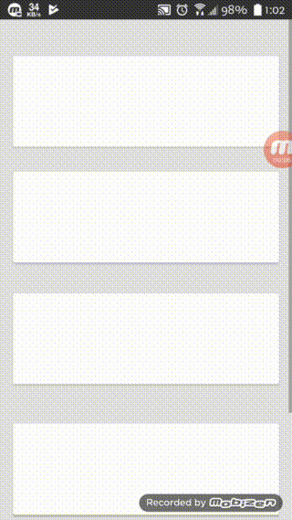
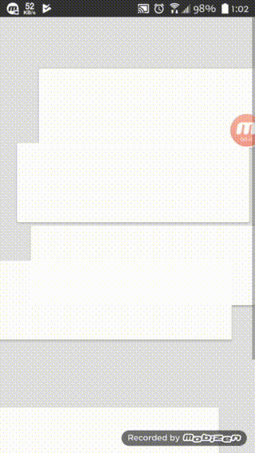
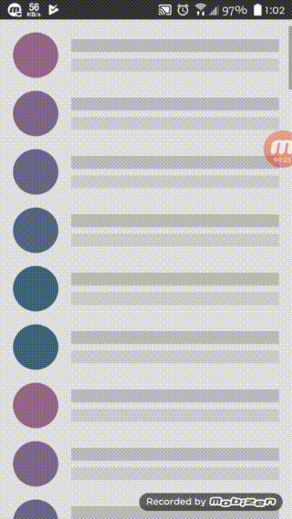

# Coordinated_Motion_Animation
This project has some very good animation branch for List elements

The default brach is empty activity
## Branch_01: Is Slide in animation example

## Branch_02: is Chaos or Random in Animation

## Branch_03: Is Recycler View curver animated Detail view Animation Activity transiction

## Branch_04: Is Resize Animation

